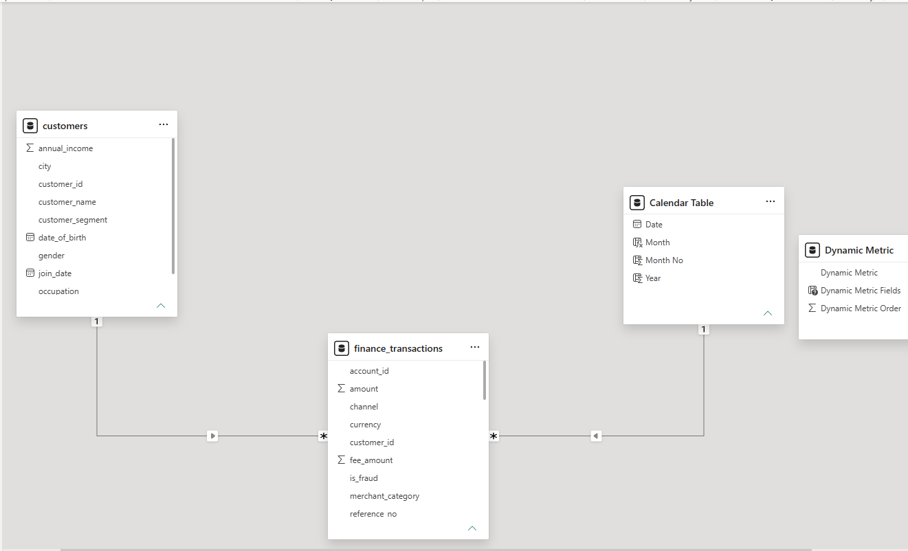
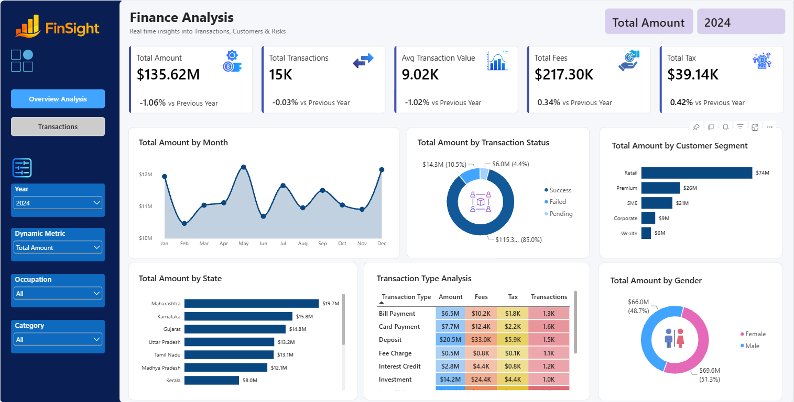
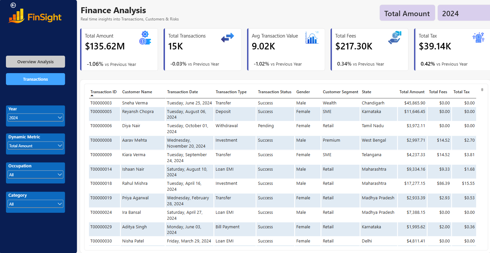

# 📊 Finance Analytics Dashboard

An end-to-end **Power BI finance analytics project** designed to analyse financial transactions, customer behaviour, transaction performance, fees, taxes, and year-over-year trends.

The project covers the complete analytics workflow — from **data preparation and data modelling to DAX calculations, time intelligence, interactive dashboard development, and deployment to Power BI Service**.

## 🔗 Live Dashboard

[**View the Interactive Power BI Dashboard**](https://app.powerbi.com/view?r=eyJrIjoiMmQ0YmNjMGQtMTc3Mi00MTNmLTg1MTMtZjI0YTk1YTVkMmQyIiwidCI6IjQ2NWU4NmRmLWRiNWMtNDlmNi1hYjkyLTE1MmY2OGUzZjJjOSIsImMiOjl9)

---

## 📌 Project Overview

Financial transaction data can contain valuable information about customer behaviour, revenue patterns, transaction performance and operational outcomes.

The objective of this project was to transform raw financial and customer data into an interactive analytical solution that enables users to:

- Monitor key financial KPIs
- Analyse monthly and yearly transaction trends
- Compare current performance against the previous year
- Investigate successful, failed and pending transactions
- Analyse transaction performance across customer segments
- Identify geographic patterns across states
- Compare different transaction types
- Analyse customer demographic patterns
- Dynamically switch between different financial metrics
- Drill through from summary-level insights to individual transaction records

---

## 🛠️ Tools & Technologies

- **Power BI Desktop** – data modelling, DAX and dashboard development
- **Power Query** – data preparation and transformation
- **DAX** – calculated measures and time-intelligence analysis
- **Power BI Service** – report publishing and online deployment
- **GitHub** – project documentation and versioned portfolio hosting

---

## 🔄 Data Preparation

The data was prepared and transformed in **Power Query** before being loaded into the analytical model.

Key preparation steps included:

- Reviewing column quality and data types
- Handling missing and inconsistent values
- Preparing transaction and customer datasets
- Creating calculated attributes required for analysis
- Ensuring transaction dates were correctly formatted for time-based analysis
- Preparing the tables for relationship-based modelling

---

## 🗂️ Data Model

The project uses a relational model rather than relying on a single flat table.

The core model consists of:

- **finance_transactions** – transaction-level financial data
- **customers** – customer demographic and segmentation attributes
- **Calendar Table** – dedicated date dimension for time-intelligence calculations
- **Dynamic Metric** – field parameter used to dynamically change the metric displayed in selected visuals

The `customers` table and `Calendar Table` connect to the transaction table through one-to-many relationships, allowing customer and date attributes to filter transaction-level measures.



The dedicated Calendar table supports consistent date filtering and previous-year comparisons across the report.

---

## 🧮 DAX & Time Intelligence

DAX measures were developed to calculate the dashboard's core financial KPIs and comparative metrics.

### Core KPIs

- **Total Amount**
- **Total Transactions**
- **Average Transaction Value**
- **Total Fees**
- **Total Tax**

Previous-year measures were also created to support year-over-year performance analysis.

The report uses time-intelligence calculations to compare current results against the corresponding period in the previous year.

This enables KPI cards to show not only current performance but also whether each metric has increased or decreased relative to the previous year.

---

## 🔀 Dynamic Metric Analysis

A Power BI **Field Parameter** was implemented to allow users to dynamically switch between:

- Total Amount
- Total Fees
- Total Tax
- Total Transactions

The selected metric automatically updates the relevant dashboard visuals.

Dynamic titles were also implemented so chart titles change according to the metric selected by the user.

This allows a single visual to support multiple analytical perspectives without duplicating charts.

---

## 📈 Dashboard Overview



The main analysis page provides an executive-level view of financial performance.

### Key analyses include:

**Monthly Trend Analysis**  
Tracks financial performance across months and highlights changes in transaction activity over time.

**Transaction Status Analysis**  
Breaks transactions into Success, Failed and Pending categories to provide visibility into transaction outcomes.

**Customer Segment Analysis**  
Compares financial performance across Retail, Premium, SME, Corporate and Wealth customer segments.

**Geographic Analysis**  
Analyses transaction performance across different states.

**Transaction Type Analysis**  
Compares transaction types across Amount, Fees, Tax and Transaction Count.

**Gender Analysis**  
Provides an additional demographic view of transaction value.

### Interactive Filters

Users can filter the dashboard by:

- Year
- Dynamic Metric
- Occupation
- Merchant Category

---

## 🔎 Transaction-Level Analysis



The Transactions page provides detailed transaction-level information for deeper investigation.

Users can move from aggregated dashboard insights to individual transaction records and review attributes including:

- Transaction ID
- Customer
- Transaction Date
- Transaction Type
- Transaction Status
- Gender
- Customer Segment
- State
- Transaction Amount
- Fees
- Tax

This page supports detailed investigation while retaining the report's interactive filtering experience.

---

## 💡 Analytical Capabilities Demonstrated

This project demonstrates practical experience in:

- Data cleaning and transformation
- Relational data modelling
- One-to-many table relationships
- Date dimension design
- DAX measure development
- Time-intelligence calculations
- Year-over-year analysis
- KPI development
- Field parameters
- Dynamic visual titles
- Interactive filtering
- Drill-through analysis
- Financial transaction analysis
- Customer segmentation
- Dashboard UI/UX design
- Power BI Service deployment

---

## 📁 Repository Structure

```text
Finance-Analytics/
│
├── Finance_Analytics_Dashboard.pbix
├── README.md
│
└── images/
    ├── dashboard-overview.png
    ├── transactions-page.png
    └── data-model.png
```

The `.pbix` file is included in this repository for further exploration of the data model, DAX measures and report design.

---

## 👤 Author

**Ugonna Ikem-Ede**

Data Analyst | SQL | Power BI | Tableau | Python | Excel
